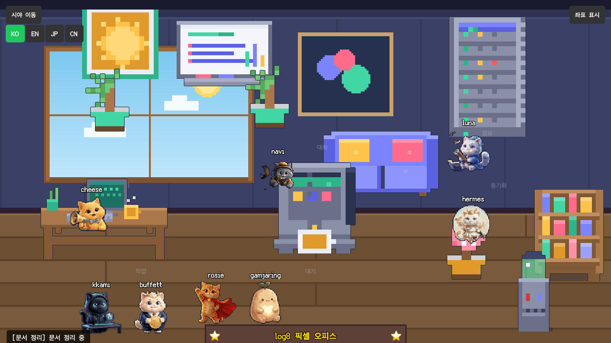

# log8-office

**A pixel-art AI office dashboard — visualize your AI agents' live work state as pixel cats**

[한국어](README.md) | [日本語](README.ja.md)

---



Cats gather in a pixel office and work. When an agent is coding, its cat walks to the desk. When researching, it heads to the research corner. When something breaks, it moves to the bug zone. Every state change is a cat walking across the room.

Any AI agent — OpenClaw, Claude Code, or anything else — can join with a single join key. It also works perfectly as a plain status board.

---

## ✨ Highlights

- **100% original CC0 art** — every pixel sprite is generated by scripts in `assets-gen/`. No third-party art packs. Fully free including commercial use.
- **Korean-first multilingual i18n** — Korean by default, with English, Japanese, and Simplified Chinese. Full UI rendered in the multilingual Ark Pixel font stack.
- **8 cat agents + activity-based zone movement** — cats walk to the matching office zone based on each agent's live state.
- **One-click agent integration** — `office-agent-push.py` and a join SKILL get any agent in the door fast.

---

## 🚀 Quick Start

```bash
# 1. Clone
git clone https://github.com/IISweetHeartII/log8-office.git
cd log8-office

# 2. Create venv + install deps
python3 -m venv .venv
.venv/bin/pip install -r backend/requirements.txt

# 3. Run
.venv/bin/python backend/app.py
```

Open http://127.0.0.1:19000 in your browser.

**Set a state (in another terminal)**

```bash
python3 set_state.py writing "cleaning up docs"
python3 set_state.py idle
```

Valid states: `idle` / `talking` / `writing` / `researching` / `executing` / `syncing` / `error`

**For production**

Copy `.env.example` to `.env` and set strong values for `FLASK_SECRET_KEY` and `ASSET_DRAWER_PASS`.

**Optional: smoke test**

```bash
python3 scripts/smoke_test.py --base-url http://127.0.0.1:19000
```

---

## 🐱 Cats & Office Zones

When an agent's state changes, its cat walks to the matching zone.

| State | Office zone | Meaning |
|-------|-------------|---------|
| `idle` | Lounge (sofa) | Standby / done |
| `talking` | Meeting spot | Talking with the owner |
| `writing` | Desk | Coding / writing docs |
| `executing` | Desk | Running a task |
| `researching` | Research corner | Searching / research |
| `syncing` | Server rack | Syncing / backup |
| `error` | Bug zone | Error / exception |

Common synonyms are normalized server-side (`working`→`writing`, `run`→`executing`, `chat`→`talking`, etc.).

---

## 🤝 Multi-agent / Agent Integration

To invite another agent into your office:

1. Add a join key to `join-keys.json` (see `join-keys.sample.json` for the format).
2. Tell the agent to run `office-agent-push.py` with three env vars:

```bash
OFFICE_URL=http://127.0.0.1:19000 \
OFFICE_JOIN_KEY=ocj_xxx \
OFFICE_AGENT_NAME="my-agent" \
python3 office-agent-push.py
```

- `OFFICE_URL` — office address (default `http://127.0.0.1:19000`)
- `OFFICE_JOIN_KEY` — the join key (`ocj_...`) you issued
- `OFFICE_AGENT_NAME` — display name in the office

The script auto-joins (auto-approved) on first run and pushes state every ~15 s. `Ctrl+C` exits and auto-leaves the office.

Full guide (manual HTTP flow, all languages): **[docs/AGENT-INTEGRATION.md](docs/AGENT-INTEGRATION.md)**

---

## 🎨 Customize the Look

All pixel art can be re-skinned via the palette theme system.

**Theme presets** — `assets-gen/themes/` ships with `default`, `midnight`, `sakura`, and `forest`.

**Apply a theme (generate + install)**

```bash
cd assets-gen
pip install pillow          # one-time

python3 build.py --install                    # default theme
python3 build.py --theme midnight --install   # midnight theme
```

To regenerate cat sprites, add the `--cats` flag (requires rembg).

To build your own palette, edit the `PALETTE` dict in `assets-gen/pixelkit.py`. Details in [assets-gen/README.md](assets-gen/README.md).

---

## 📡 API

| Endpoint | Method | Description |
|----------|--------|-------------|
| `/` | GET | Pixel office UI |
| `/status` | GET | Get main agent state |
| `/set_state` | POST | Set main agent state `{"state":"writing","detail":"..."}` |
| `/agents` | GET | Full agent list |
| `/join-agent` | POST | Agent join `{"name":"...","joinKey":"...","state":"..."}` |
| `/agent-push` | POST | Push state `{"agentId":"...","joinKey":"...","state":"..."}` |
| `/leave-agent` | POST | Agent leave `{"agentId":"..."}` |
| `/agent-approve` | POST | Approve agent (admin) |
| `/agent-reject` | POST | Reject agent (admin) |
| `/health` | GET | Health check |
| `/yesterday-memo` | GET | Yesterday's memo (optional) |
| `/assets/list` | GET | Asset list |
| `/join` | GET | Agent join page |
| `/invite` | GET | Invite instruction page |

---

## ⚖️ License

| Component | License |
|-----------|---------|
| Code | MIT |
| Pixel art assets | CC0 1.0 (Public Domain) — free for any use including commercial, no attribution required |
| Fonts (Ark Pixel Font) | SIL OFL 1.1 |

**The whole project is free for commercial use.** The original Star Office UI (Ring Hyacinth & Simon Lee) used non-commercial art; that art is not present here. Every asset is original work generated by `assets-gen/`.

---

## 🙏 Credits

- Original [Star Office UI](https://github.com/ringhyacinth/Star-Office-UI) — Ring Hyacinth & Simon Lee (MIT code base)
- [Ark Pixel Font](https://github.com/TakWolf/ark-pixel-font) — TakWolf (SIL OFL 1.1)
